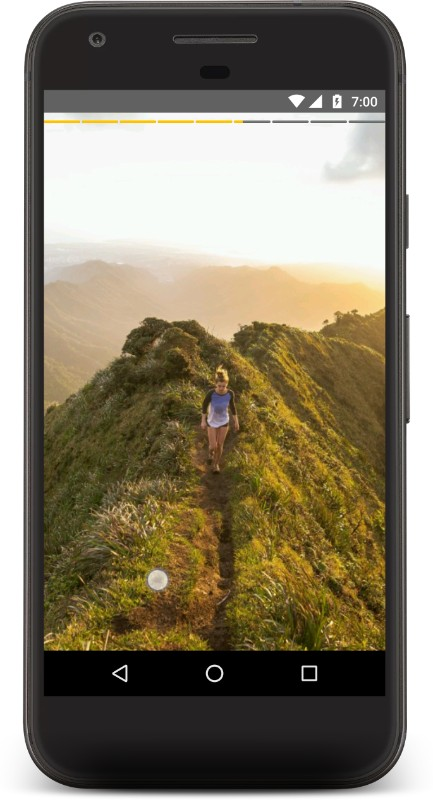

# StatusStories

StatusStories is an photo view implementation of
- Snapchat stories
- Instagram stories
- Whatsapp Statuses
- Facebook Messenger Stories

APK
https://goo.gl/jZzyg8


Video
https://goo.gl/7Jx6Hx




Features at glance
------------------
- Highly customizable Stories view
- Click left right edge to move forward or previous just like whatsapp
- Hold the center area to pause
- Cache the images using glide

How to Use
----------

#1. As this uses Glide internally, please add this to root level repositories as this library uses glide to load the images.
```groovy
        maven { name 'glide-snapshot'; url 'http://oss.sonatype.org/content/repositories/snapshots' }
```

#2 Since you want to launch thw Status Stories Activity Add this to your project manifest inside <application> tag

```xml
        <activity android:name="com.rahuljanagouda.statussories.StatusStoriesActivity"/>
```
#3 Launch the activity with the configuration
```java
        Intent a = new Intent(view.getContext(), StatusStoriesActivity.class);
        a.putExtra(StatusStoriesActivity.STATUS_RESOURCES_KEY, resources);
        a.putExtra(StatusStoriesActivity.STATUS_DURATION_KEY, storyDuration);
        a.putExtra(StatusStoriesActivity.IS_IMMERSIVE_KEY, isImmersiveEnabled);
        a.putExtra(StatusStoriesActivity.IS_CACHING_ENABLED_KEY, isCacheEnabled);
        a.putExtra(StatusStoriesActivity.IS_TEXT_PROGRESS_ENABLED_KEY, isTextEnabled);
        startActivity(a);
```

Install
-------
Add it in your root build.gradle at the end of repositories:

```groovy
allprojects {
		repositories {
			...
			maven { url "https://jitpack.io" }
		}
}

```

Add the dependency

```
	dependencies {
	        compile 'com.github.shts:StoriesProgressView:1.2.0'
	}

```