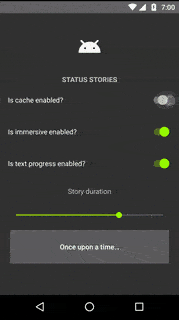
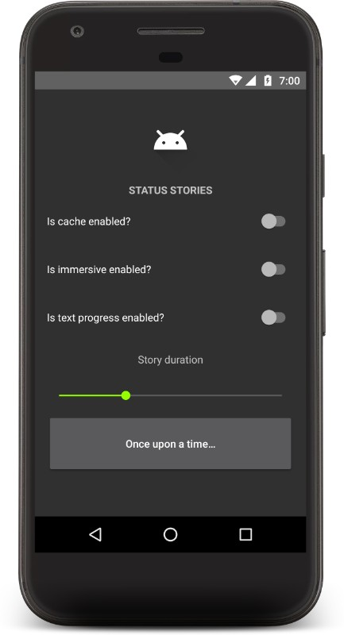
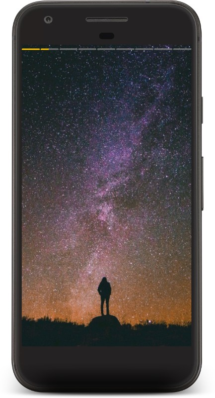
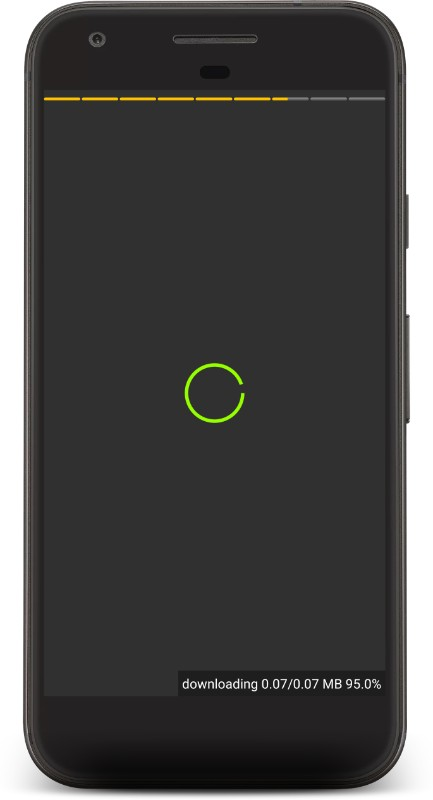
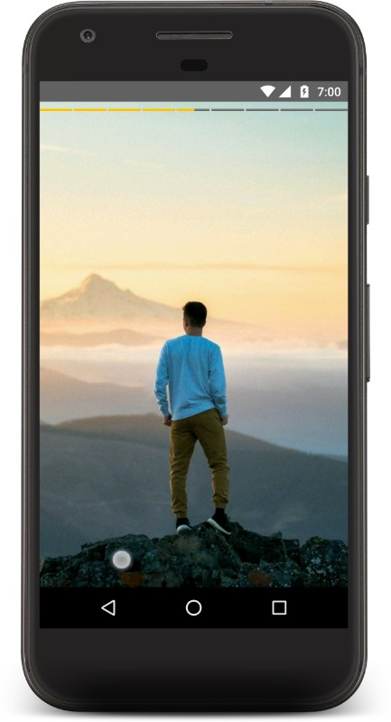

# StatusStories
#### [APK Link](https://goo.gl/jZzyg8) | [Video Link](https://goo.gl/7Jx6Hx)
StatusStories helps you implement Photo Stories similar to
- Snapchat stories
- Instagram stories
- Whatsapp Statuses
- Facebook Messenger Stories



 

 


## Features at glance
- Highly customizable Stories view
- Click left right edge to move forward or previous just like WhatsApp
- Hold the center area to pause
- Cache the images using glide
- Progress bar indicates the downloaded content from the internet
- Immersive mode enables the more engaging experience
- Control the duration of each Story
- Finishes after the last story ends


## Install
#1 Add the below lines in your root build.gradle. This library is using glide internally to download and cache the images.

```groovy
	allprojects {
        repositories {
            ...
            jcenter()
            maven { url "https://jitpack.io" }
            maven { name 'glide-snapshot'; url 'http://oss.sonatype.org/content/repositories/snapshots' }
        }
    }
```

#2. Add the dependency
```
	dependencies {
	        compile 'com.github.RahulJanagouda:StatusStories:1.0.1'
	}
```

## How to Use
Launch the activity with the configuration
```java
    //urls array that should be shown as a story
    private final String[] resources = new String[]{
            "https://firebasestorage.googleapis.com/v0/b/firebase-satya.appspot.com/o/images%2Fi00001.jpg?alt=media&token=460667e4-e084-4dc5-b873-eefa028cec32",
            "https://firebasestorage.googleapis.com/v0/b/firebase-satya.appspot.com/o/images%2Fi00002.jpg?alt=media&token=e8e86192-eb5d-4e99-b1a8-f00debcdc016",
            "https://firebasestorage.googleapis.com/v0/b/firebase-satya.appspot.com/o/images%2Fi00004.jpg?alt=media&token=af71cbf5-4be3-4f8a-8a2b-2994bce38377",
            "https://firebasestorage.googleapis.com/v0/b/firebase-satya.appspot.com/o/images%2Fi00005.jpg?alt=media&token=7d179938-c419-44f4-b965-1993858d6e71",
            "https://firebasestorage.googleapis.com/v0/b/firebase-satya.appspot.com/o/images%2Fi00006.jpg?alt=media&token=cdd14cf5-6ed0-4fb7-95f5-74618528a48b",
            "https://firebasestorage.googleapis.com/v0/b/firebase-satya.appspot.com/o/images%2Fi00007.jpg?alt=media&token=98524820-6d7c-4fb4-89b1-65301e1d6053",
            "https://firebasestorage.googleapis.com/v0/b/firebase-satya.appspot.com/o/images%2Fi00008.jpg?alt=media&token=7ef9ed49-3221-4d49-8fb4-2c79e5dab333",
            "https://firebasestorage.googleapis.com/v0/b/firebase-satya.appspot.com/o/images%2Fi00009.jpg?alt=media&token=00d56a11-7a92-4998-a05a-e1dd77b02fe4",
            "https://firebasestorage.googleapis.com/v0/b/firebase-satya.appspot.com/o/images%2Fi00010.jpg?alt=media&token=24f8f091-acb9-432a-ae0f-7e6227d18803",
    };

        //launch with presettings
        Intent a = new Intent(view.getContext(), StatusStoriesActivity.class);
        a.putExtra(StatusStoriesActivity.STATUS_RESOURCES_KEY, resources);
        a.putExtra(StatusStoriesActivity.STATUS_DURATION_KEY, 3000L);
        a.putExtra(StatusStoriesActivity.IS_IMMERSIVE_KEY, true);
        a.putExtra(StatusStoriesActivity.IS_CACHING_ENABLED_KEY, true);
        a.putExtra(StatusStoriesActivity.IS_TEXT_PROGRESS_ENABLED_KEY, true);
        startActivity(a);
```

# TODO

- [ ] Write tests 🌚
- [ ] Pre-fetch/pre-load the next image
- [ ] Supporting customizing contents loaded in each screen Video, Gifs, anyt view
- [ ] Implement swipeable

## License

```
Copyright (C) 2017 Rahul Janagouda

Licensed under the Apache License, Version 2.0 (the "License");
you may not use this file except in compliance with the License.
You may obtain a copy of the License at

     http://www.apache.org/licenses/LICENSE-2.0

Unless required by applicable law or agreed to in writing, software
distributed under the License is distributed on an "AS IS" BASIS,
WITHOUT WARRANTIES OR CONDITIONS OF ANY KIND, either express or implied.
See the License for the specific language governing permissions and
limitations under the License.
```
